# 从0到1搭建脚手架(TS + pnpm)

## 1.初始化项目
### 利用pnpm创建monorepo
> 便于调试脚手架命令和功能
在`根目录`下创建一个`pnpm-workspace.yaml`文件，创建对应的目录`packages/mele-cli`和`examples/test`
```yaml
packages: 
  - 'packages/*' # 用于编写脚手架源码
  - 'examples/*' # 用于测试packages中脚手架命令和功能
```
- 主工作区命令要加 `-w`参数，例如: `pnpm add -D -w mele-cli`安装依赖
- 子工作区不用

### 命令创建package.json
> 分别在`根目录`、`packages/mele-cli`和`examples/test`下运行
```sh
# npm
npm init
# pnpm
pnpm init
```
#### 填写`package.json`基本信息
##### `package.json`
```json
{
  "name": "mele", // 包名
  "version": "0.0.1", // 版本
  "description": "A front-end scaffolding tool", // 描述
  "main": "index.js", // 入口文件
  "scripts": { // npm脚本
    "test": "echo \"Error: no test specified\" && exit 1"
  },
  "author": "melelong", // 作者
  "license": "MIT" // 开源协议
}
```
##### `packages/mele-cli/package.json`
```json
{
  "name": "mele-cli", // 脚手架名字
  "version": "0.0.1", // 版本
  "description": "A front-end scaffolding tool", // 描述
  "main": "./src/index.js", // 入口文件
  "bin": { // 声明脚手架命令
    "mele": "./bin/index.js" 
  },
  "repository": { // 代码仓库
    "type": "git", // 仓库类型
    "url": "https://github.com/melelong/mele" // 仓库地址
  },
    "homepage": "https://github.com/melelong/mele", // 使用文档地址 
  "scripts": { // npm脚本
    "test": "echo \"Error: no test specified\" && exit 1"
  },
  "keywords": [ // npm搜索关键词
    "mele",
    "mele-cli",
    "front-end",
    "format",
    "eslint",
    "husky",
    "prettier",
    "vue",
    "react",
    "angular"
  ],
  "author": "melelong", // 作者
  "license": "MIT" // 开源协议
}
```
##### `examples/test/package.json`
```json
{
  "name": "test",// 包名
  "version": "0.0.1", // 版本
  "description": "用于测试packages中脚手架命令和功能", // 描述
  "main": "index.js", // 入口文件
  "scripts": { // npm脚本
    "mele": "mele" // 脚手架命令
  },
  "dependencies": { // 生产依赖
    "mele-cli": "workspace:*" // 安装packages/mele-cli的包
  },
  "author": "melelong", // 作者
  "license": "MIT" // 开源协议
}
```
##### 创建`.gitignore`文件
>依赖包(`node_modules`)不提交到git仓库
```sh
node_modules
```
##### 创建`packages/mele-cli/bin/index.js`文件
> 脚手架命令定义文件(PS: `#!/usr/bin/env node`一定要加上，告诉电脑以node方式执行脚本)
```javascript
#!/usr/bin/env node

console.log(`Hello mele-cli`)
```
##### 目录结构
> 发布npm的时候，就进入`packages/mele-cli`单独发布就可以了
```sh
| -- mele # 根目录
|   | -- packages
|   |   | -- mele-cli # 脚手架源码
|   |   |   |-- bin # 脚手架命令
|   |   |   |   |-- index.js
|   |   |   |-- src # 源码
|   |   |   |   |-- index.js
|   |   |   |-- package.json
|   |   |   |-- README.md # 使用文档
|   | -- examples
|   |   | -- test # 测试例子
|   |   |   |-- package.json
|   |-- .gitignore # 排除git提交的文件
|   |-- pnpm-workspace.yaml
|   |-- package.json
|   |-- README.md # 使用文档
```
##### 测试
> 在`根目录`运行`pnpm i`，进入`examples/test`目录，运行`pnpm mele`测试脚手架命令

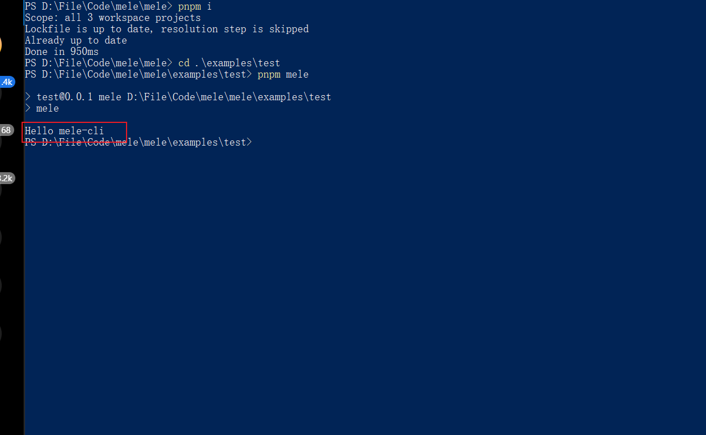
### 安装用到的依赖
> 有助于开发代码规范
#### husky
> 进入`根目录`下
- 安装
```sh
# 安装
pnpm add -D -w husky
# 初始化
pnpm dlx husky-init
# 测试钩子
git add .
git commit -m 'test'
```
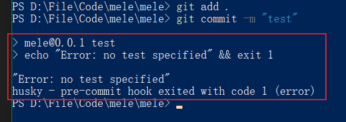
#### typescript、@types/node和ts-node
> 进入`packages/mele-cli`下
```sh
# 安装
pnpm add -D typescript ts-node @types/node
```
- 初始化
> 把`packages/mele-cli/src`下`js`文件改成`ts`文件,并把npm脚本命令添加到`packages/mele-cli/package.json`
```json
{
  "scripts": {
    "ts:init": "npx tsc --init", // 初始化ts配置文件，pnpm ts:init
    "ts:run": "ts-node", // 运行ts文件，pnpm ts:run ts文件路径
    "dev": "ts-node ./src/index.ts" // 运行ts文件，pnpm dev
  }
}
```
#### eslint
> 进入`packages/mele-cli`下
- 安装
```sh
# 安装并初始化
 pnpm create @eslint/config@latest
```
- 检测并发现问题
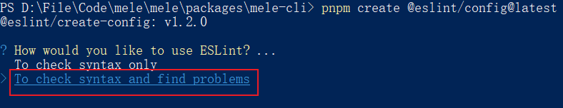
- `TS`支持es模块
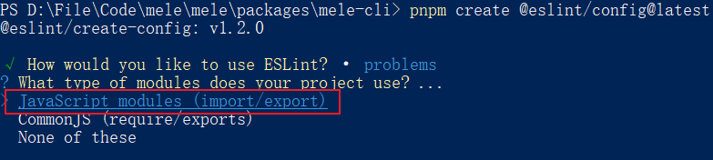
- 写的是脚手架，不是前端项目
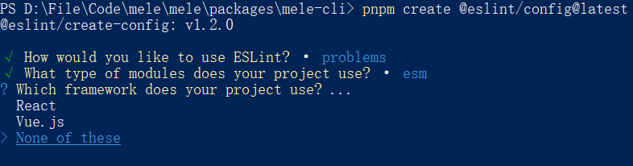
- 是否支持`TS`
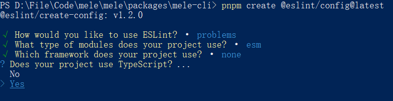
- 运行在`node`端
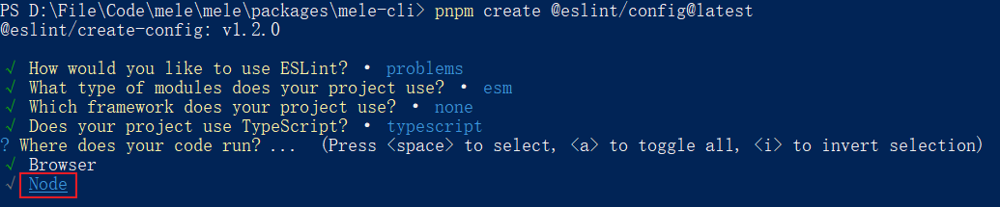
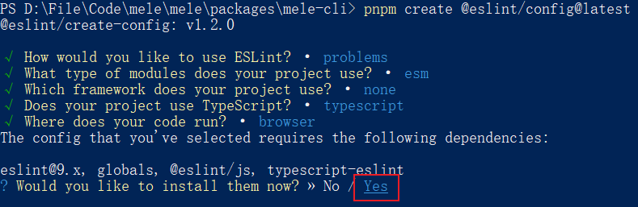
- 用pnpm安装
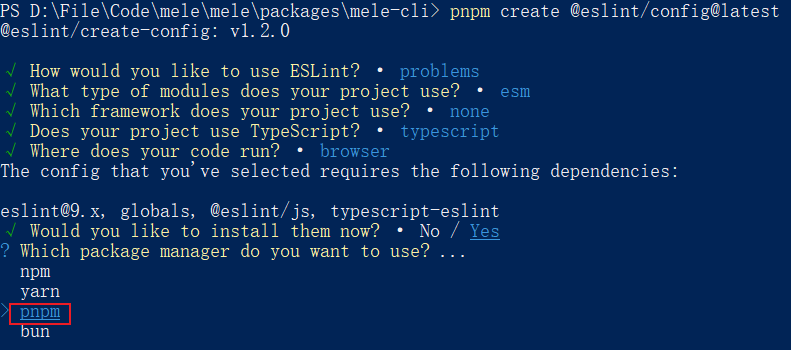
- 安装完成
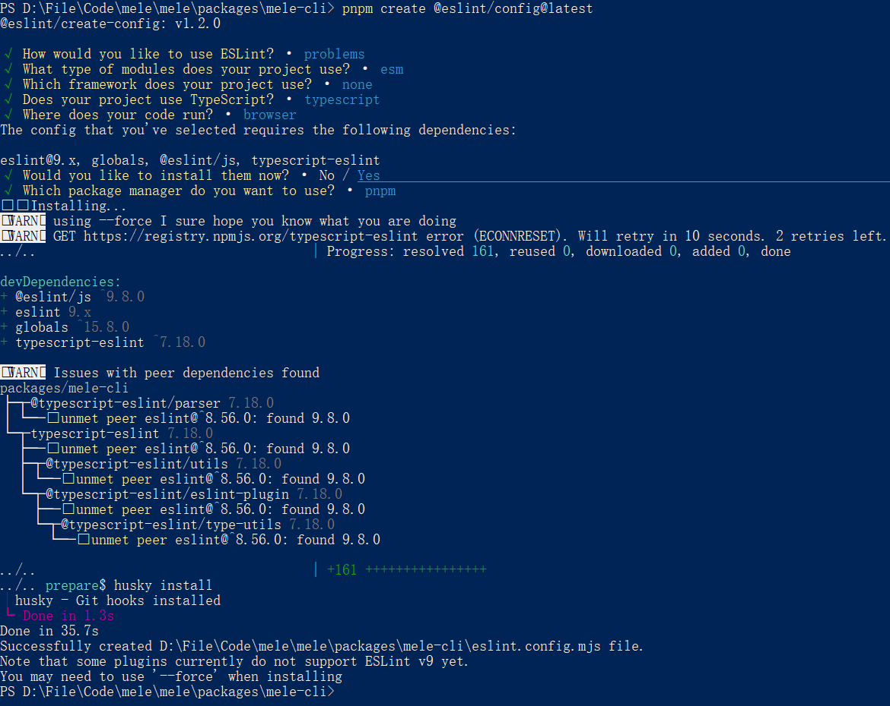
- `packages/mele-cli/eslint.config.mjs`
```javascript
import globals from "globals";
import pluginJs from "@eslint/js";
import tseslint from "typescript-eslint";
export default [
  { files: ["**/*.{js,mjs,cjs,ts}"] },
  { languageOptions: { globals: globals.node } },
  pluginJs.configs.recommended,
  ...tseslint.configs.recommended,
];
```
- 把npm脚本命令添加到`packages/mele-cli/package.json`
```json
"scripts": {
    "lint": "eslint . --fix" // eslint检测
  }
```
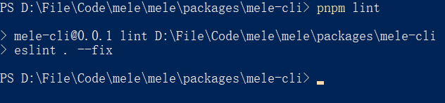
#### prettier、eslint-config-prettier和eslint-plugin-prettier
> 进入`packages/mele-cli`目录下
- 安装
```sh
pnpm add -D prettier eslint-config-prettier eslint-plugin-prettier
```
- 创建`packages/mele-cli/.prettierrc.cjs`文件
```javascript
module.exports = {
  $schema: 'https: //json.schemastore.org/prettierrc',
  semi: false,
  singleQuote: true,
  tabWidth: 2,
  endOfLine: 'lf',
  printWidth: 100,
  useTabs: false,
  proseWrap: 'always',
  trailingComma: 'none'
}
```
- 把配置和插件添加到`packages/mele-cli/eslint.config.mjs`
```javascript
import globals from 'globals'
import pluginJs from '@eslint/js'
import tseslint from 'typescript-eslint'
import eslintConfigPrettier from 'eslint-config-prettier'
import pluginPrettier from 'eslint-plugin-prettier'
export default [
  { files: ['**/*.{js,mjs,cjs,ts}'] },
  { languageOptions: { globals: globals.node } },
  pluginJs.configs.recommended,
  ...tseslint.configs.recommended,
  eslintConfigPrettier,
  {
    files: ['**/*.{js,mjs,cjs,ts}'],
    plugins: {
      pluginPrettier: pluginPrettier
    }
  }
]
```
- 把npm脚本命令添加到`packages/mele-cli/package.json`
```json
"scripts": {
    "format": "prettier . --write" // 代码格式化
  }
```
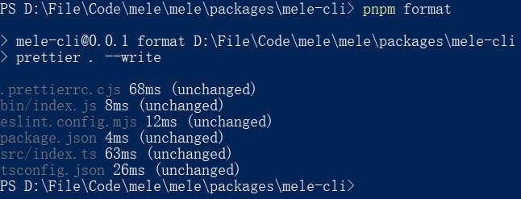
#### lint-staged
> 进入`根目录`下
- 安装
```sh
pnpm add -D -w lint-staged
```
- 把npm脚本命令和`lint-staged`配置添加到`package.json`
```json
{
  "scripts": {
    "lint": "cd ./packages/mele-cli & pnpm lint & cd ../..", // eslint检测脚手架代码
    "format": "cd ./packages/mele-cli & pnpm format & cd ../..", // 格式化脚手架代码
    "stage": "lint-staged", // 运行lint-staged
  },
  "lint-staged": {
    "**/*.{js,cjs,mjs,ts,json}": [
      "pnpm lint",
      "pnpm format"
    ]
  }
}
```
- 修改`./.husky/pre-commit`文件
```sh
#!/usr/bin/env sh
. "$(dirname -- "$0")/_/husky.sh"

pnpm stage
```
- 测试提交
```sh
git add .
```
## 2.脚手架必备模块
- 命令参数模块
- 用户交互模块
- 文件拷贝模块
- 动态文件生成模块
- 自动安装依赖模块

### 2.1 命令参数模块
### 2.2 用户交互模块
### 2.3 文件拷贝模块
### 2.4 动态文件生成模块
### 2.5 自动安装依赖模块