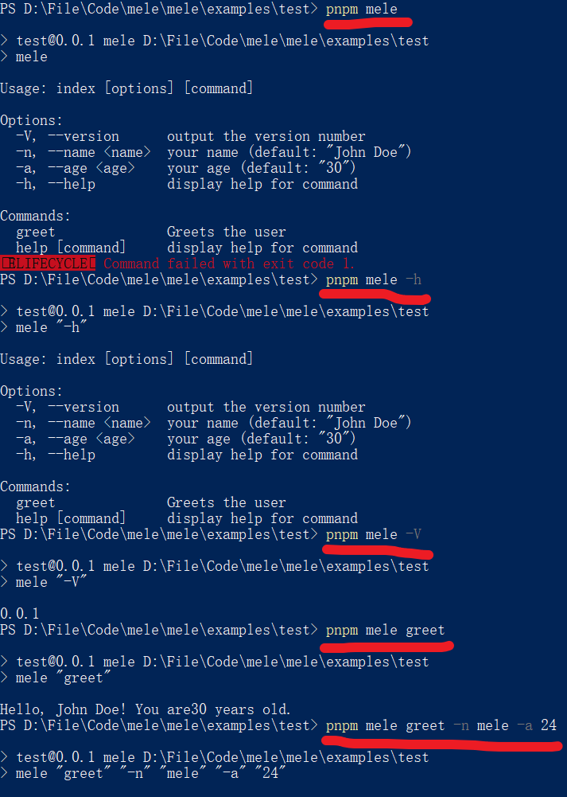
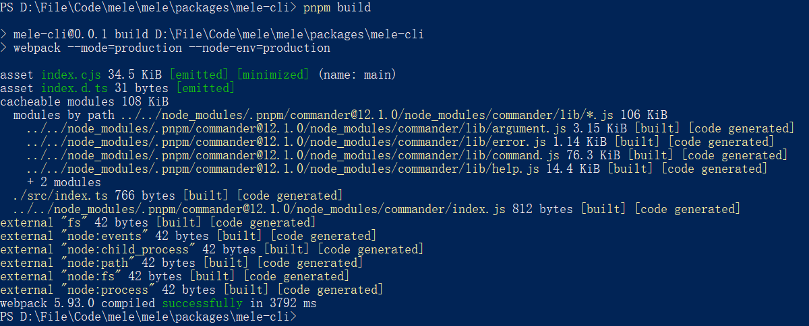

# 从0到1搭建脚手架(TS + pnpm)

## 1.初始化项目
### 利用pnpm创建monorepo
> 便于调试脚手架命令和功能
在`根目录`下创建一个`pnpm-workspace.yaml`文件，创建对应的目录`packages/mele-cli`和`examples/test`
```yaml
packages: 
  - 'packages/*' # 用于编写脚手架源码
  - 'examples/*' # 用于测试packages中脚手架命令和功能
```
- 主工作区命令要加 `-w`参数，例如: `pnpm add -D -w mele-cli`安装依赖
- 子工作区不用

### 命令创建package.json
> 分别在`根目录`、`packages/mele-cli`和`examples/test`下运行
```sh
# npm
npm init
# pnpm
pnpm init
```
#### 填写`package.json`基本信息
##### `package.json`
```json
{
  "name": "mele", // 包名
  "version": "0.0.1", // 版本
  "description": "A front-end scaffolding tool", // 描述
  "main": "index.js", // 入口文件
  "scripts": { // npm脚本
    "test": "echo \"Error: no test specified\" && exit 1"
  },
  "author": "melelong", // 作者
  "license": "MIT" // 开源协议
}
```
##### `packages/mele-cli/package.json`
```json
{
  "name": "mele-cli", // 脚手架名字
  "version": "0.0.1", // 版本
  "description": "A front-end scaffolding tool", // 描述
  "main": "./src/index.js", // 入口文件
  "bin": { // 声明脚手架命令
    "mele": "./bin/index.js" 
  },
  "repository": { // 代码仓库
    "type": "git", // 仓库类型
    "url": "https://github.com/melelong/mele" // 仓库地址
  },
    "homepage": "https://github.com/melelong/mele", // 使用文档地址 
  "scripts": { // npm脚本
    "test": "echo \"Error: no test specified\" && exit 1"
  },
  "keywords": [ // npm搜索关键词
    "mele",
    "mele-cli",
    "front-end",
    "format",
    "eslint",
    "husky",
    "prettier",
    "vue",
    "react",
    "angular"
  ],
  "author": "melelong", // 作者
  "license": "MIT" // 开源协议
}
```
##### `examples/test/package.json`
```json
{
  "name": "test",// 包名
  "version": "0.0.1", // 版本
  "description": "用于测试packages中脚手架命令和功能", // 描述
  "main": "index.js", // 入口文件
  "scripts": { // npm脚本
    "mele": "mele" // 脚手架命令
  },
  "dependencies": { // 生产依赖
    "mele-cli": "workspace:*" // 安装packages/mele-cli的包
  },
  "author": "melelong", // 作者
  "license": "MIT" // 开源协议
}
```
##### 创建`.gitignore`文件
>依赖包(`node_modules`)不提交到git仓库
```sh
node_modules
```
##### 创建`packages/mele-cli/bin/index.js`文件
> 脚手架命令定义文件(PS: `#!/usr/bin/env node`一定要加上，告诉电脑以node方式执行脚本)
```javascript
#!/usr/bin/env node

console.log(`Hello mele-cli`)
```
##### 目录结构
> 发布npm的时候，就进入`packages/mele-cli`单独发布就可以了
```sh
| -- mele # 根目录
|   | -- packages
|   |   | -- mele-cli # 脚手架源码
|   |   |   | -- bin # 脚手架命令
|   |   |   |   | -- index.js
|   |   |   | -- src # 源码
|   |   |   |   | -- index.js
|   |   |   | -- package.json
|   |   |   | -- README.md # 使用文档
|   | -- examples
|   |   | -- test # 测试例子
|   |   |   | -- package.json
|   | -- .gitignore # 排除git提交的文件
|   | -- pnpm-workspace.yaml
|   | -- package.json
|   | -- README.md # 使用文档
```
##### 测试
> 在`根目录`运行`pnpm i`，进入`examples/test`目录，运行`pnpm mele`测试脚手架命令


### 安装用到的依赖
> 有助于开发代码规范
#### husky
> 进入`根目录`下
- ##### 安装
```sh
# 安装
pnpm add -D -w husky
# 初始化
pnpm dlx husky-init
# 测试钩子
git add .
git commit -m 'test'
```

#### typescript、@types/node和ts-node
> 进入`packages/mele-cli`下
- ##### 安装
```sh
# 安装
pnpm add -D typescript ts-node @types/node
```
- ##### 初始化
> 把`packages/mele-cli/src`下`js`文件改成`ts`文件,并把npm脚本命令添加到`packages/mele-cli/package.json`,运行`pnpm ts:init`生成配置文件
- ###### `packages/mele-cli/package.json`
```json
{
  "scripts": {
    "ts:init": "tsc --init", // 初始化ts配置文件，pnpm ts:init
    "ts:build":"tsc", // 编译ts文件，pnpm ts:build
    "ts:run": "ts-node", // 运行ts文件，pnpm ts:run ts文件路径
    "dev": "ts-node ./src/index.ts" // 运行ts文件，pnpm dev
  }
}
```
- ###### 修改`packages/mele-cli/tsconfig.json`
```json
{
  /* 编译器选项配置，用于指导TypeScript如何编译代码 */
  "compilerOptions": {
    /* 指定编译后输出文件的目录 */
    "outDir": "./bin",
    /* 设置项目的根目录，用于解析相对路径 */
    "baseUrl": "./",
    /* 指定目标JavaScript版本 */
    "target": "ES5",
    "paths": {
      "@": ["./src"]
    },
    /* 允许在TypeScript项目中使用JavaScript文件 */
    "allowJs": true,
    /* 指定模块解析策略 */
    "moduleResolution": "node",
    /* 指定模块系统 */
    "module": "CommonJS",
    /* 允许使用ES6模块导出的语法 */
    "esModuleInterop": true,
    /* 在导入文件名大小写不一致时仍能正确导入 */
    "forceConsistentCasingInFileNames": false,
    /* 跳过库文件的类型检查，加快编译速度 */
    "skipLibCheck": true,
    /* 生成类型声明文件 */
    "declaration": true,
    /* 不输出注释 */
    "removeComments": true,
    /* 允许非默认导出的模块使用default导入 */
    "allowSyntheticDefaultImports": true,
    /* 启用增量构建，提高构建效率 */
    "incremental": true,
    /* 严格检查null值的赋值和传播 */
    "strictNullChecks": false,
    /* 禁止隐式any类型 */
    "noImplicitAny": false,
    /* 严格检查bind、call和apply的使用 */
    "strictBindCallApply": false,
    /* 禁止switch语句中case穿透 */
    "noFallthroughCasesInSwitch": false
  },
  "include": ["src/**/*"],
  "exclude": ["node_modules", "dist", "bin"]
}
```
- ###### 测试编译
```sh
pnpm ts:build
```


#### eslint
> 进入`packages/mele-cli`下
- ##### 安装
```sh
# 安装并初始化
 pnpm create @eslint/config@latest
```
- ##### 检测并发现问题

- ##### `TS`支持es模块

- ##### 写的是脚手架，不是前端项目

- ##### 是否支持`TS`

- ##### 运行在`node`端


- ##### 用pnpm安装

- ##### 安装完成

- ##### `packages/mele-cli/eslint.config.mjs`
```javascript
import globals from "globals";
import pluginJs from "@eslint/js";
import tseslint from "typescript-eslint";
export default [
  { files: ["**/*.{js,mjs,cjs,ts}"] },
  { languageOptions: { globals: globals.node } },
  pluginJs.configs.recommended,
  ...tseslint.configs.recommended,
];
```
- ##### 把npm脚本命令添加到`packages/mele-cli/package.json`
```json
{
  "scripts": {
    "lint": "eslint . --fix" // eslint检测
  }
}
```

#### prettier、eslint-config-prettier和eslint-plugin-prettier
> 进入`packages/mele-cli`目录下
- ##### 安装
```sh
pnpm add -D prettier eslint-config-prettier eslint-plugin-prettier
```
- ##### 创建`packages/mele-cli/.prettierrc.cjs`文件
```javascript
module.exports = {
  $schema: 'https: //json.schemastore.org/prettierrc',
  semi: false,
  singleQuote: true,
  tabWidth: 2,
  endOfLine: 'lf',
  printWidth: 100,
  useTabs: false,
  proseWrap: 'always',
  trailingComma: 'none'
}
```
- ##### 把配置和插件添加到`packages/mele-cli/eslint.config.mjs`
```javascript
import globals from 'globals'
import pluginJs from '@eslint/js'
import tseslint from 'typescript-eslint'
import eslintConfigPrettier from 'eslint-config-prettier'
import pluginPrettier from 'eslint-plugin-prettier'
export default [
  { files: ['**/*.{js,mjs,cjs,ts}'] },
  { languageOptions: { globals: globals.node } },
  pluginJs.configs.recommended,
  ...tseslint.configs.recommended,
  eslintConfigPrettier,
  {
    files: ['**/*.{js,mjs,cjs,ts}'],
    plugins: {
      pluginPrettier: pluginPrettier
    }
  }
]
```
- ##### 把npm脚本命令添加到`packages/mele-cli/package.json`
```json
{
  "scripts": {
    "format": "prettier . --write" // 代码格式化
  }
}
```

#### lint-staged
> 进入`根目录`下
- ##### 安装
```sh
pnpm add -D -w lint-staged
```
- ##### 把npm脚本命令和`lint-staged`配置添加到`package.json`
```json
{
  "scripts": {
    "lint": "pnpm --filter=mele-cli lint", // eslint检测脚手架代码
    "format": "pnpm --filter=mele-cli format", // 格式化脚手架代码
    "stage": "lint-staged", // 运行lint-staged
  },
  "lint-staged": {
    "packages/mele-cli/**/*.{js,cjs,mjs,ts,json}": [
      "pnpm --filter=mele-cli lint",
      "pnpm --filter=mele-cli format"
    ]
  }
}
```
- ##### 修改`./.husky/pre-commit`文件
```sh
#!/usr/bin/env sh
. "$(dirname -- "$0")/_/husky.sh"

pnpm stage
```
- ##### 测试提交
```sh
# 测试钩子
git add .
git commit -m 'test'
git push
```

## 2.脚手架必备模块
- 命令参数模块
- 用户交互模块
- 文件拷贝模块
- 动态文件生成模块
- 自动安装依赖模块

### 2.1 配置打包工具(用tsc打包优缺点，第三方的库tsc打包不了)
#### webpack、webpack-cli、ts-loader和CleanWebpackPlugin
> 进入`packages/mele-cli`下
- webpack、webpack-cli(用于打包)
- @webpack-cli/generators(用于生成配置文件)
- ts-loader(用于解析TS)
- CleanWebpackPlugin(用于清理打包结果)
- ##### 安装
```sh
pnpm add -D webpack webpack-cli @webpack-cli/generators ts-loader CleanWebpackPlugin
```
- ##### 把npm脚本命令添加到`packages/mele-cli/package.json`
```json
{
  "scripts": {
    "webpack:init": "webpack init", // 初始化配置
  }
}
```
- ##### 初始化配置文件
```sh
pnpm webpack:init
```
###### 使用`TS`

###### 脚手架是脚本工具不用，安装开发服务器

###### 用不到HTML

###### 用不到PWA

###### 用不到CSS

###### 用pnpm

###### 是否覆盖原来的package.json

###### 查看差异


###### 覆盖的话把信息都改了，所以终止覆盖，后面补上新加的npm脚本


- ##### 把刚刚要新增的npm脚本补上
```json
{
  "scripts": {
    "build":"webpack --mode=production --node-env=production",
    "build:dev":"webpack --mode=development",
    "build:prod":"webpack --mode=production --node-env=production",
    "watch":"webpack --watch"
  }
}
```
- ##### 修改`webpack.config.js`配置文件
```javascript
/* eslint-disable @typescript-eslint/no-var-requires */
const path = require('path')
const { CleanWebpackPlugin } = require('clean-webpack-plugin')
// 判断环境
const isProduction = process.env.NODE_ENV == 'production'
const config = {
  entry: './src/index.ts', // 入口文件
  output: {
    path: path.resolve(__dirname, 'bin'), // 打包目录
    filename: 'index.cjs', // 打包产物名cjs
    library: {
      name: 'mele-cli',
      type: 'commonjs' // 类型 commonjs
    }
  },
  target: "node", // 打包结果node环境
  plugins: [new CleanWebpackPlugin()],
  module: {
    rules: [
      {
        test: /\.(ts|tsx)$/i, // 解析ts文件
        loader: 'ts-loader',
        exclude: ['/node_modules/'] // 排除node_modules
      },
      {
        test: /\.(eot|svg|ttf|woff|woff2|png|jpg|gif)$/i,
        type: 'asset'
      }
    ]
  },
  resolve: {
    extensions: ['.tsx', '.ts', '.jsx', '.js', '.mjs', '.cjs', '...'] // 解析文件
  },
  stats: {
    errorDetails: true
  }
}
module.exports = () => {
  if (isProduction) {
    config.mode = 'production'
  } else {
    config.mode = 'development'
  }
  return config
}
```
- ##### 修改`packages/mele-cli/package.json`
```json
{
  "bin": {
    "mele": "./bin/index.cjs"
  },
}
```
- ##### 修改`packages/mele-cli/src/index.ts`
```javascript
#!/usr/bin/env node

import { readFileSync } from 'fs'
console.log('readFileSync', readFileSync)
```
- ##### 测试一下
```sh
pnpm build
```
> 打包成功


```sh
# 进入测试项目
cd ../../examples/test
# 重新安装依赖
pnpm i
# 测试脚手架命令
pnpm mele
```
> 测试成功

#### babel-loader、@babel/core和@babel/preset-env(兼容性)
> 进入`packages/mele-cli`下
- babel-loader(用于解析js语法)
- @babel/core(babel核心包)
- @babel/preset-env(babel预设)
> 虽然`tsc`也可以转换兼容性强的代码,但是只限于ts文件。babel可以兼容性更好,有些特殊语法可以利用babel强大的插件去转换
- ##### 安装
```sh
pnpm add -D babel-loader @babel/core @babel/preset-env
```
- ##### 修改`webpack.config.js`配置文件
```javascript
{
  module: {
    rules: [
      {
        test: /\.m?js$/,
        exclude: /node_modules/,
        use: {
          loader: "babel-loader",
          options: {
            presets: ['@babel/preset-env']
          }
        }
      }
    ]
  }
}
```
- ##### 创建`babel.config.json`配置文件
```json
{
  "presets": ["@babel/preset-env"]
}
```
- ##### 测试一下
```sh
pnpm build
```

### 2.2 命令参数模块
#### 期望的效果

#### 获取命令参数

##### Node.js(`process.argv`)
> nodejs 中的process.argv 属性返回一个数组，其中包含启动 Node.js 进程时的命令行参数
```javascript
const process = require('process');
// 获取命令参数
console.log(process.argv);
```
##### `commander` 推荐
> 进入`packages/mele-cli`目录下
- ###### 安装
```sh
pnpm add commander
```
- ###### 修改`packages/mele-cli/src/index.ts`
```javascript
// 基础用法，详细用法看文档(https://github.com/tj/commander.js/blob/master/Readme_zh-CN.md)
#!/usr/bin/env node
import { program } from 'commander'
import { readFileSync } from 'fs'
// 导入package.json
const json = JSON.parse(readFileSync('./package.json', 'utf-8'))
// 设置版本号
program.version(json?.version || '未知版本号')
// 定义命令选项
program
  .option('-n, --name <name>', 'your name', 'John Doe')
  .option('-a, --age <age>', 'your age', '30')
// 定义命令
program
  .command('greet') // 命令名称
  .description('Greets the user') // 命令描述
  .action((_option) => {
    console.log(`Hello, ${program.opts().name}! You are${program.opts().age} years old.`)
  })
// 解析命令行参数
program.parse(process.argv)
```
- ##### 测试一下
```sh
# 打包
pnpm build
# 进入测试项目
cd ../../examples/test
# 重新安装依赖
pnpm i
# 测试脚手架命令
pnpm mele
pnpm mele -h
pnpm mele -V
pnpm mele greet
pnpm mele greet -n mele -a 24
```
###### 打包命令执行效果

###### 脚手架命令执行效果

### 2.3 用户交互模块
#### 
### 2.4 文件拷贝模块
### 2.5 动态文件生成模块
### 2.6 自动安装依赖模块